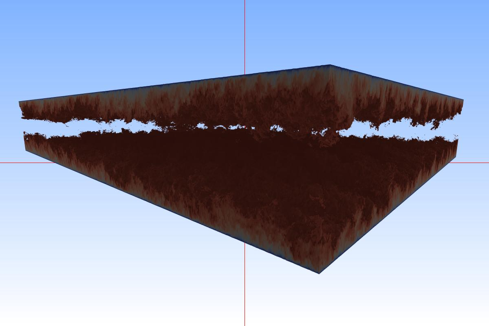
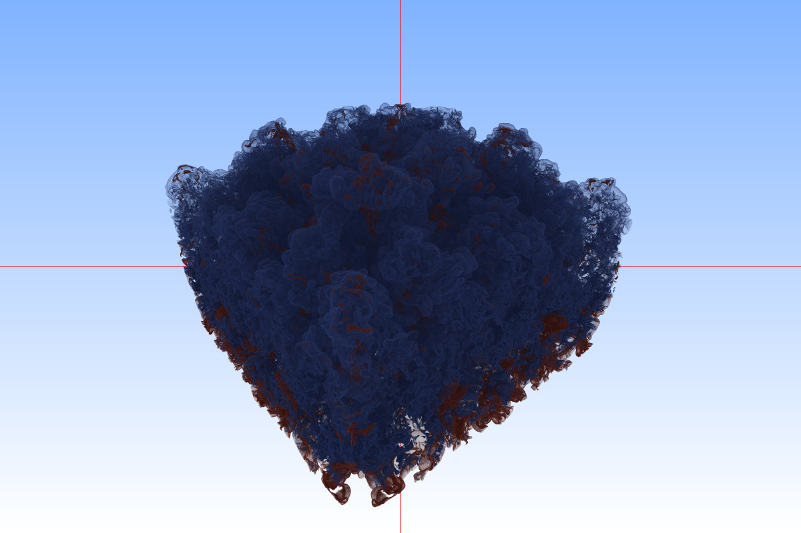
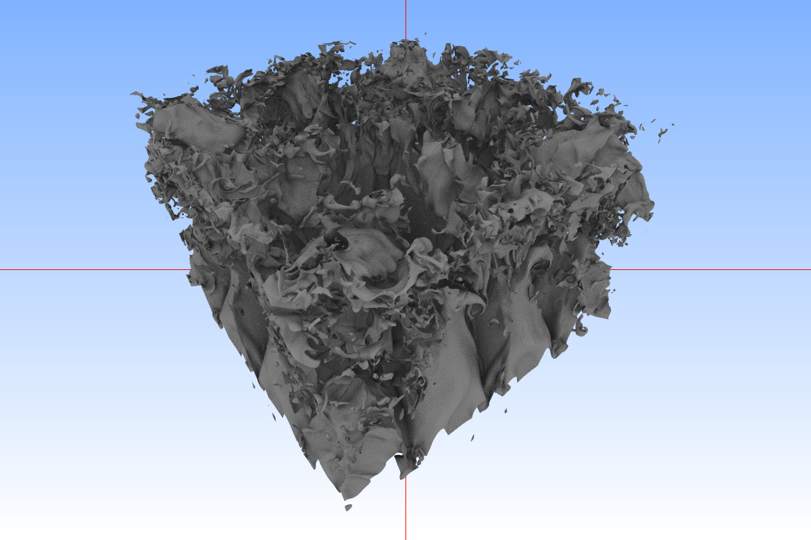

# HayStack

# Building and Running

..
dependencies

    sudo apt install libtbb-dev cmake-curses-gui libglfw3-dev build-essential libopenmpi-dev qtbase5-dev libucx-dev libpmix-dev libgtk-3-dev

# MPI

For data parallel work you need to have mpi installed with cuda
support. for openmpi 4.1.6, build with

    ./configure --enable-cxx-exceptions --with-cuda=/usr/local/cuda --with-cuda-libdir=/usr/lib/x86_64-linux-gnu/ --prefix=/mnt/nfs/opt

# Example Data Sets and How to Run Them

## "Fun3D Lander"

Lander is a data dump from the NASA Fun3D unstructured mesh simulation
code. Of particular interest is that Fun3D is using mpi-parallel CFD,
and in its data dump stores not ony the final resulting tets, hexes,
scalrs, etc, but actually stores "per rank" information as well; i.e.,
we can reproduce exactly which rank had had which data during
simulation --- meaning this makes for a really good "strawman" for
in-situ rendering. 

Some high-level data:

- Lander-small: 144.9M vertices, ca 800M elements (mostly but not all
  tets). Data internally organized in *72* per-rank meshes. Good field
  to visualize `vort_mag`, time step `9000`

- Lander-large: Data internally organized in *552*(?) per-rank meshes.

### Conversion/importing progress

Original lander data dump from Fun3D looks like this:

    wald@hasky:~/models$ ll unstructured/lander-small
    total 25k
    drwxrwxr-x 4 wald wald 4.1k Sep 28  2020 ./
    drwx------ 3 wald wald 4.1k Nov 17 14:40 ../
    drwxrwxr-x 2 wald wald 4.1k Sep 28  2020 10000unsteadyiters/
    drwxrwxr-x 2 wald wald  13k Sep 28  2020 geometry/

In the following I assume the original fun3d data is in
`~/models/unstructured/lander-small/`. I also assume you have cloned
and built the `umesh` helper library (https://gitlab.com/ingowald/umesh).

To convert such data:

1) figure out what kind of variables and time steps are contained in
this dump:

    ./umeshBreakApartFun3D ~/models/unstructured/lander-small/geometry/dAgpu0145_Fa_me --scalars ~/models/unstructured/lander-small/10000unsteadyiters/dAgpu0145_Fa_volume_data.
	
for small lander, `vort_mag` and `9000` are good variable and time
step to visualize.

2) convert to per-rank umesh data:

    ./umeshBreakApartFun3D ~/models/unstructured/lander-small/geometry/dAgpu0145_Fa_me --scalars ~/models/unstructured/lander-small/10000unsteadyiters/dAgpu0145_Fa_volume_data. -ts 9000 -var vort_mag -o ~/per-rank/lander-small-vort_mag-9000.

This should (for small lander) create 72 different umesh files in `~/per-rank/`

3) To render in barney/haystack, simply pass all umesh files on the cmdline

    mpirun <mpiconfig> ./hsViewer ~/per-rank/lander-small-vort_mag-9000.* lander-small-surface.obj -ndg <numgroups> 
   
The `lander-small-surface.obj` file contains the triangular surface of the lander that is supposed to be 'inside' the volume. It can be found here: https://drive.google.com/file/d/11i8bw_ND388rOftfRXqQwdbV8zmcCxQV/view?usp=sharing

Notes:

- it is suggested to use a pre-saved transfer function. (TODO: where
  to get/find one?)
  

## Tim Sandstrom "Spheres and Triangles" Data

To run the "jahmad" model (from Tim Sandstom at AMES)  -including spheres and a hex-helicopter surface mock-up -- use this:

    ./hsViewer spheres://16@/home/wald/models/sandstrom-spheres/jahmad/30172.xyz.flt.1:count=400M:radius=.003 -ndg 2 ts.tri:///home/wald/models/sandstrom-spheres/jahmad/srf.30172.tri
	
Make sure to adjust `count=` `-ndg` and `16@` values when running on a
larger machine (the above is for dual-RTX 8000, single workstation)

## Engine

    /home/wald/opt/bin/mpirun -n 2 /cluster/hsViewerQT raw://2@/cluster/engine_256x256x128_uint8.raw:format=uint8:dims=256,256,128 -xf /cluster/engine.xf --camera 316.657 220.631 67.4258 128.608 103.132 38.6924 0 0 1 -fovy 60

## DNS-one-eighth

Single-node, dual-gpu, multi-gpu data-parallel (no MPI):

    ./hsViewerQT raw://2@/cluster/dns-one-eighth-5120-3840-768.raw:format=float:dims=5120,3840,768 -ndg 2  --camera -456.228 4753.82 611.822 2376.76 1678.84 -150.28 0 0 1 -fovy 60 -xf /cluster/dns-one-eighth.xf
	

same w/ MPI, single node:

    /home/wald/opt/bin/mpirun -n 2 -host localhost:2 /cluster/hsViewerQT raw://2@/cluster/dns-one-eighth-5120-3840-768.raw:format=float:dims=5120,3840,768 -ndg 2  --camera -456.228 4753.82 611.822 2376.76 1678.84 -150.28 0 0 1 -fovy 60 -xf /cluster/dns-one-eighth.xf

## Structured Data: LLNL (subset, so it also runs on laptop)

### Local-node Rendering

    ./hsViewerQT raw:///home/wald/models/structured/llnl_0250.raw:format=uint8:dims=2048,2048,1920:extract=512,512,512,1024,1024,1024 --camera 2066.13 1846.6 242.936 1061.26 1013.85 971.708 0 0 -1 -fovy 60 -xf /home/wald/models/structured/llnl.xf

### Data-Parallel Rendering

To run data parallel (in this case, 2):
- run with mpirun
- change `raw://<path>` to `raw://2@<path>` (in this case, to split into 2 parts)
- specify num data groups to, in this example, 2:  `-ndg 2`

    /home/wald/opt/bin/mpirun -n 2 ./hsViewerQT raw://2@/home/wald/models/structured/llnl_0250.raw:format=uint8:dims=2048,2048,1920:extract=512,512,512,1024,1024,1024 --camera 2066.13 1846.6 242.936 1061.26 1013.85 971.708 0 0 -1 -fovy 60 -xf /home/wald/models/structured/llnl.xf -ndg 2

## Data-Parallel Banari, Structured Data

assumes that libanari_library_barney and libanari etc are all in same dir

### KingSnake (1024x1024x795)

    /home/wald/opt/bin/mpirun -n 2 /home/wald/Projects/hayStack/with-hanari/hsViewerQT raw://2@/mnt/raid/new_models/raw/kingsnake_1024x1024x795_uint8.raw:format=uint8:dims=1024,1024,795 -ndg 2 -xf /home/wald/Projects/hayStack/data/kingsnake.xf `cat /home/wald/Projects/hayStack/data/kingsnake.cam`

### kingsnake (1024x1024x795) 2 ranks, 4 gpus

	/home/wald/opt/bin/mpirun -n 4 -x LD_LIBRARY_PATH=/mnt/nfs/wald/opt/lib -host trinity:2,wally:2 /mnt/nfs/wald/hsViewerQT raw://4@/mnt/nfs/shared/raw/kingsnake_1024x1024x795_uint8.raw:format=uint8:dims=1024,1024,795 -ndg 4 -xf /mnt/nfs/shared/raw/kingsnake.xf `cat /mnt/nfs/shared/raw/kingsnake.cam`

### rotstrat (SUSBET FOR NOW)

	/home/wald/opt/bin/mpirun -n 2 /home/wald/Projects/hayStack/with-hanari/hsViewerQT raw://2@/mnt/raid/new_models/raw/rotstrat_temperature_4096x4096x4096_float32.raw:format=float:dims=4096,4094,4096:extract=0,0,0,1024,1024,1024 -ndg 2

## Data-Parallel Iso-Surface from Structured Data: LLNL (subset, so it also runs on laptop)

same as previous example with LLNL data-parallel volume rendeirng,
just add "iso=0.5" to content loader. This will perform data parallel
loading (using `-ndg ...` and `raw://<ndg>@...`), then extract
iso-surface (meaning each rank has iso-surface for its part of
volume), then perform surface rendering on that.

    /home/wald/opt/bin/mpirun -n 2 ./hsViewerQT raw://2@/home/wald/models/structured/llnl_0250.raw:format=uint8:dims=2048,2048,1920:extract=512,512,512,1024,1024,1024 --camera 2066.13 1846.6 242.936 1061.26 1013.85 971.708 0 0 -1 -fovy 60 -xf /home/wald/models/structured/llnl.xf -ndg 2

## lander-small, SPATIAL partitioning

given already-merged single umesh for lander-small, break it into 4 spatially paritioned pieces:

    ./umeshPartitionSpatially /mnt/raid/nfs/shared/umesh/lander-small-vort_mag-9800.umesh -o /mnt/raid/nfs/shared/barney/lander-small-vort_mag-9800-n4 -n 4

## lander-small, ORIGINAL (object-space) partitioning

given original fun3d data dump directory, import each rank's data into a separate umesh:

    
    ./umeshBreakApartFun3D -o /mnt/raid/space/barney/lander-small //mnt/raid/new_models/unstructured/lander-small/geometry/dAgpu0145_Fa_me --scalars /mnt/raid/new_models/unstructured/lander-small/10000unsteadyiters/dAgpu0145_Fa_volume_data. -var vort_mag -ts 9800
	
then running on (in this example) 2 ranks (for my 2x8000 machine):

	mm && /home/wald/opt/bin/mpirun -n 2 ./hsViewerQT /mnt/raid/space/barney/lander-small.*umesh -mum -ndg 2 -xf lander-small-3.xf `cat lander-small-3.cam` /mnt/raid/nfs/shared/umesh/lander-small-surface.obj

to run offline

    mm && /home/wald/opt/bin/mpirun -n 2 ./hsOffline /mnt/raid/space/barney/lander-small.*umesh -mum -ndg 2 -xf lander-small-3.xf `cat lander-small-3.cam` /mnt/raid/nfs/shared/umesh/lander-small-surface.obj --num-frames 128 -o lander-small-offline.png
	
camera and xf file checked into this repo, under `data/`

	
